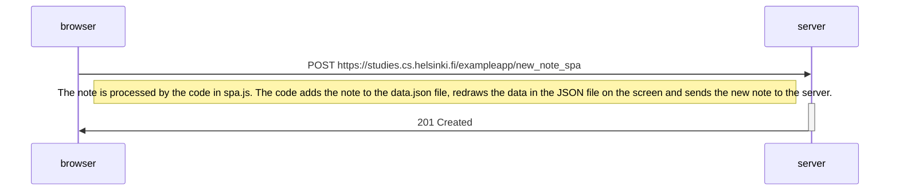

```mermaid
sequenceDiagram
    participant browser
    participant server
    
    browser->>server: POST https://studies.cs.helsinki.fi/exampleapp/new_note_spa
    Note right of browser: The note is processed by the code in spa.js. The code adds the note to the data.json file, redraws the data in the JSON file on the screen and sends the new note to the server.
    activate server
    server->>browser: 201 Created
    deactivate server    
``` 